```mermaid
graph TB
    %% User Interaction Layer
    USER[👤 User] --> |"Chat Messages"| FRONTEND
    
    %% Frontend Layer
    subgraph "Frontend Layer (Port 3000)"
        FRONTEND[🖥️ React/TypeScript UI]
        FRONTEND --> |"Real-time Streaming"| CHAT[💬 Chat Interface]
        FRONTEND --> |"Display Metrics"| METRICS_UI[📊 llama.cpp Metrics Panel]
    end
    
    %% Backend Layer
    subgraph "Backend Layer (Port 8080)"
        API[🚀 Go Backend Server]
        API --> |"Structured Logging"| LOGGER[📝 Zerolog]
        API --> |"Collect Metrics"| PROM_METRICS[📈 Prometheus Metrics]
        API --> |"Generate Traces"| TRACER[🔍 OpenTelemetry]
    end
    
    %% Model Inference Layer
    subgraph "AI Model Layer (Port 12434)"
        MODEL_RUNNER[🤖 Docker Model Runner]
        MODEL_RUNNER --> |"llama.cpp Integration"| LLAMA[🦙 Llama 3.2 Model]
        LLAMA --> |"Performance Data"| LLAMA_METRICS[⚡ llama.cpp Metrics]
    end
    
    %% Observability Stack
    subgraph "Observability Stack"
        subgraph "Metrics (Port 9091)"
            PROMETHEUS[📊 Prometheus]
        end
        
        subgraph "Visualization (Port 3001)"
            GRAFANA[📈 Grafana Dashboards]
        end
        
        subgraph "Tracing (Port 16686)"
            JAEGER[🔍 Jaeger UI]
        end
    end
    
    %% Data Flow Connections
    FRONTEND --> |"HTTP/WebSocket"| API
    API --> |"Model Requests"| MODEL_RUNNER
    MODEL_RUNNER --> |"Streaming Responses"| API
    API --> |"Token Stream"| FRONTEND
    
    %% Observability Connections
    API --> |"Expose /metrics"| PROMETHEUS
    LLAMA_METRICS --> |"Performance Data"| PROMETHEUS
    PROMETHEUS --> |"Data Source"| GRAFANA
    TRACER --> |"Trace Data"| JAEGER
    
    %% Real-time Metrics Flow
    LLAMA_METRICS --> |"Live Updates"| METRICS_UI
    
    %% Styling
    classDef frontend fill:#61dafb,stroke:#333,stroke-width:2px,color:#000
    classDef backend fill:#00add8,stroke:#333,stroke-width:2px,color:#fff
    classDef model fill:#ff6b6b,stroke:#333,stroke-width:2px,color:#fff
    classDef observability fill:#f39c12,stroke:#333,stroke-width:2px,color:#000
    classDef user fill:#2ecc71,stroke:#333,stroke-width:2px,color:#fff
    
    class FRONTEND,CHAT,METRICS_UI frontend
    class API,LOGGER,PROM_METRICS,TRACER backend
    class MODEL_RUNNER,LLAMA,LLAMA_METRICS model
    class PROMETHEUS,GRAFANA,JAEGER observability
    class USER user
```

## System Architecture Overview

This diagram represents the complete GenAI Model Runner Metrics system architecture with the following key components:

### 🖥️ **Frontend Layer (Port 3000)**
- **React/TypeScript UI**: Modern responsive chat interface
- **Real-time Streaming**: Displays tokens as they're generated
- **llama.cpp Metrics Panel**: Live performance metrics display
- **Light/Dark Mode**: Theme support based on user preferences

### 🚀 **Backend Layer (Port 8080)**
- **Go API Server**: Handles HTTP/WebSocket connections
- **Structured Logging**: JSON logs with zerolog
- **Prometheus Metrics**: Custom metrics collection
- **OpenTelemetry Tracing**: Distributed tracing support
- **CORS Enabled**: Cross-origin resource sharing

### 🤖 **AI Model Layer (Port 12434)**
- **Docker Model Runner**: Containerized model execution
- **Llama 3.2 Model**: Local LLM inference
- **llama.cpp Integration**: Performance-optimized inference
- **Real-time Metrics**: Tokens/sec, memory usage, thread utilization

### 📊 **Observability Stack**
- **Prometheus (Port 9091)**: Metrics collection and storage
- **Grafana (Port 3001)**: Visualization dashboards
- **Jaeger (Port 16686)**: Distributed tracing UI

### 🔄 **Data Flow**
1. User sends chat messages through the React frontend
2. Frontend streams requests to Go backend via HTTP/WebSocket
3. Backend processes and forwards requests to Model Runner
4. Llama 3.2 generates responses with real-time streaming
5. Performance metrics flow to both UI and Prometheus
6. Grafana visualizes historical metrics and trends
7. Jaeger traces request flows across services

### ⚡ **Key Features**
- **Real-time Streaming**: Tokens appear as generated
- **Live Metrics**: Performance data in UI and Grafana
- **Local Inference**: No cloud API dependencies
- **Comprehensive Monitoring**: Metrics, logs, and traces
- **Containerized Deployment**: Docker Compose setup
- **Integration Testing**: Testcontainers support
